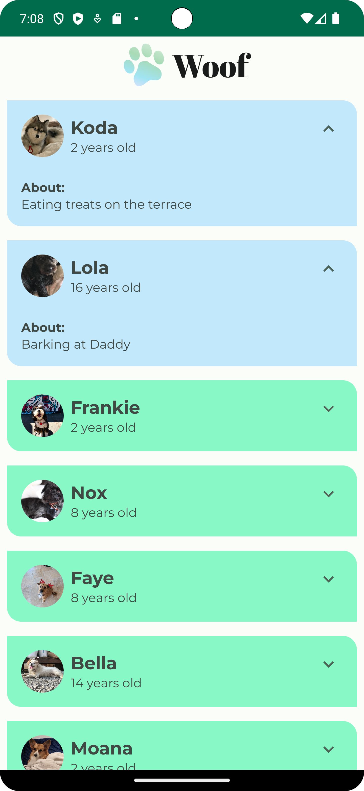
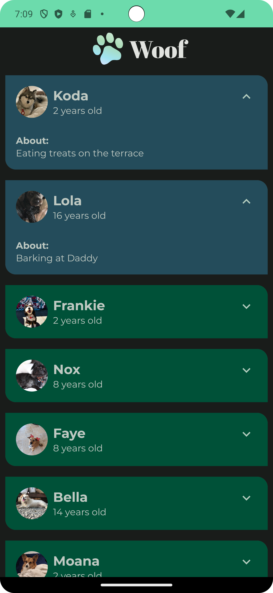

Woof App
==================================

The Woof app is a list of dog photos with information about them including their name, age, and favorite activity. This app also uses Material Design to create a beautiful app experience for the user.  It's developed using Jetpack Compose components like ```Column```, ```Button```, ```Text```, ```Image```, and ```Modifier```.

<p align="center">
  

</p>

Getting Started
---------------

1. Download the project
2. Open the project in Android Studio
3. Run the project
